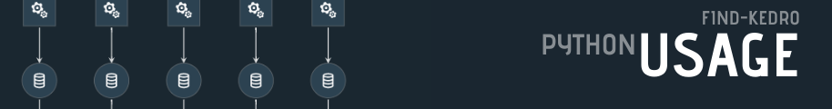
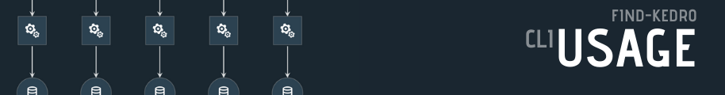
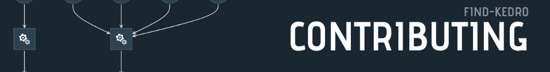
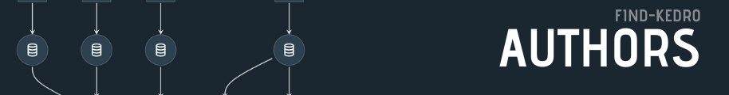

# 

`find-kedro` is a small library to enhance your kedro experience.  It looks through your modules to find kedro pipelines, nodes, and iterables (lists, sets, tuples) of nodes.  It then assembles them into a dictionary of pipelines, each module will create a separate pipeline, and `__default__` being a combination of all pipelines.  This format is compatible with the kedro `_create_pipelines` format.


[](https://find-kedro.waylonwalker.com)


## 

`kedro` is a ✨ fantastic project that allows for super-fast prototyping of data pipelines, while yielding production-ready pipelines. `find-kedro` enhances this experience by adding a pytest like node/pipeline discovery eliminating the need to bubble up pipelines through modules.

When working on larger pipeline projects, it is advisable to break your project down into different sub-modules which requires knowledge of building python libraries, and knowing how to import each module correctly.  While this is not too difficult, in some cases, it can trip up even the most senior engineers, losing precious feature development time to debugging a library.

## 

`find-kedro` is deployed to pypi and can easily be `pip` installed.

``` console
pip install find-kedro
```

## 

The recommended usage of `find-kedro` is to implement it directly into your projects `run.py` module

``` python
from kedro.context import KedroContext
from find_kedro import find_kedro

class ProjectContext(KedroContext):
    def _get_pipelines(self) -> Pipeline:
        return find_kedro()
```

### Creating nodes

`find-kedro` will not execute any functions.  It will simply look for variables that match the `pattern` and identify if they are a `kedro.pipeline.Pipeline`, `kedro.pipeline.nodes.Node`, or a list of `kedro.pipeline.nodes.  Node`'s.  If so, it will collect them into the dictionary of pipelines.

There are typically **three** ways that pipelines are constructed with `find-kedro`; **lists**, **single-nodes**, and **pipelines**.

#### Lists

Any pattern matched list will be flattened and collected into the pipeline.  Nodes can be created all at once in the list definition.

``` python
# my-proj/pipelinies/data_engineering/pipeline
from kedro.pipeline import node
from .nodes import split_data

pipeline = [
    node(
        split_data,
        ["example_iris_data", "params:example_test_data_ratio"],
        dict(
            train_x="example_train_x",
            train_y="example_train_y",
            test_x="example_test_x",
            test_y="example_test_y",
        ),
    )
]
```

It is also convenient many times to keep the node definition close to the function definition.  Many times I define the list at the top of the file, then append to it as I go.

``` python
# my-proj/pipelinies/data_engineering/pipeline
from kedro.pipeline import node
from .nodes import split_data

nodes = []
nodes.append(
    node(
        split_data,
        ["example_iris_data", "params:example_test_data_ratio"],
        dict(
            train_x="example_train_x",
            train_y="example_train_y",
            test_x="example_test_x",
            test_y="example_test_y",
        ),
    )
)
```

#### Nodes

All pattern matched `kedro.pipeline.node.Node` objects will get collected into the pipeline.

``` python
# my-proj/pipelinies/data_engineering/pipeline
from kedro.pipeline import node
from .nodes import split_data

split_node = node(
        split_data,
        ["example_iris_data", "params:example_test_data_ratio"],
        dict(
            train_x="example_train_x",
            train_y="example_train_y",
            test_x="example_test_x",
            test_y="example_test_y",
        ),
    )
```

#### Pipeline

All pattern matched `kedro.pipeline.Pipeline` objects will get collected into the pipeline.

``` python
# my-project/pipelinies/data_engineering/pipeline
from kedro.pipeline import node, Pipeline
from .nodes import split_data

split_node = Pipeline(
    [
        node(
            split_data,
            ["example_iris_data", "params:example_test_data_ratio"],
            dict(
                train_x="example_train_x",
                train_y="example_train_y",
                test_x="example_test_x",
                test_y="example_test_y",
            ),
        )
    ]
)
```


### Fully Qualified imports

When using fully qualified imports `from my_proj.pipelines.data_science.nodes import split_data` instead of 
relative imports `from .nodes split_data` you will need to make sure that your project is installed, in your current path, or you set the directory

### 

The CLI provides a handy interface to search your project for nodes

```
Usage: find-kedro [OPTIONS]

Options:
  --file-patterns TEXT       glob-style file patterns for Python node module
                             discovery

  --patterns TEXT            prefixes or glob names for Python pipeline, node,
                             or list object discovery

  -d, --directory DIRECTORY  Path to save the static site to
  --version                  Prints version and exits
  -v, --verbose              Prints extra information for debugging
  --help                     Show this message and exit.
```

Example ran with a slightly modified default `kedro new` project.

``` bash
❯ find-kedro
{
  "__default__": [
    "split_data([example_iris_data,params:example_test_data_ratio]) -> [example_test_x,example_test_y,example_train_x,example_train_y]",
    "train_model([example_train_x,example_train_y,parameters]) -> [example_model]",
    "predict([example_model,example_test_x]) -> [example_predictions]",
    "report_accuracy([example_predictions,example_test_y]) -> None"
  ],
  "src.default_kedro_159.pipelines.data_engineering.pipeline": [
    "split_data([example_iris_data,params:example_test_data_ratio]) -> [example_test_x,example_test_y,example_train_x,example_train_y]"
  ],
  "src.default_kedro_159.pipelines.data_science.pipeline": [
    "train_model([example_train_x,example_train_y,parameters]) -> [example_model]",
    "predict([example_model,example_test_x]) -> [example_predictions]",
    "report_accuracy([example_predictions,example_test_y]) -> None"
  ]
}
```
## 

**You're Awesome** for considering a contribution!  Contributions are welcome, please check out the [Contributing Guide](./contributing.md) for more information.  Please be a positive member of the community and embrace feedback

## 

We use [SemVer](https://semver.org/) for versioning. For the versions available, see the [tags on this repository](./tags).


## 

[](https://github.com/WaylonWalker) - Waylon Walker - _Original Author_

[](https://github.com/mzjp2) - Zain Patel

## 

This project is licensed under the MIT License - see the LICENSE.md file for details
