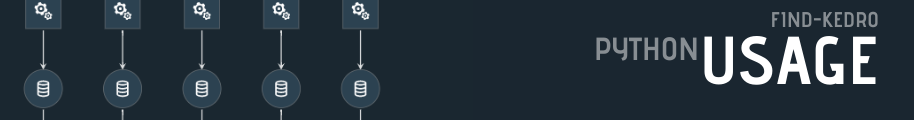

# 

The reccomended usage of `find-kedro` is to implement it directly into your
projects `run.py` module

``` python
# my-proj/src/run.py
from kedro.context import KedroContext
from find_kedro import find_kedro

class ProjectContext(KedroContext):
    def _get_pipelines(self) -> Pipeline:
        return find_kedro()
```

# Creating nodes

`find-kedro` will not execute any functions, it will simply look for variables 
that match the `pattern` and identify if they are a `kedro.pipeline.Pipeline`,
`kedro.pipeline.nodes.Node`, or a list of `kedro.pipeline.nodes.Node`.  If so
it will collect them into the dictionary of pipelines.

There are currently **three** ways that pipelines are typically constructed with
`find-kedro`; **lists**, **single-nodes**, **pipelines**.

## Lists

Any pattern matched list will be flattened and collected into the pipeline.  They
can be created all at once in the list definition.

``` python
# my-proj/src/pipelinies/data_engineering/pipeline
from kedro.pipeline import node
from .nodes import split_data

pipeline = [
    node(
        func=clean_columns,
        inputs='raw_iris',
        outputs='int_iris',
        name="create_int_iris",
        tags=['iris', 'int']
    )
]
```

<div class="termy">

``` console
// run find-kedro
$ find-kedro

{
  "__default__": [
    "create_int_iris",
  ],
  "pipelines.data_engineering.pipeline": [
    "create_int_iris",
  ],
```
</div>

It is also convenient many times to keep the node definition close to the function
definition of the node to be ran.  for this reason.  Many times I define the 
list at the top of the file, then append to it as I go.

``` python
# my-proj/src/pipelinies/data_engineering/pipeline
from kedro.pipeline import node
from .nodes import split_data

nodes = []
nodes.append(
    node(
        func=clean_columns,
        inputs='raw_iris',
        outputs='int_iris',
        name="create_int_iris",
        tags=['iris', 'int']
      )
    )
]
)
```

## Nodes

All pattern matched `kedro.pipeline.node.Node` objects will be collected into the
pipeline.


``` python
# my-proj/pipelinies/data_engineering/pipeline
from kedro.pipeline import node
from .nodes import split_data

clean_raw_iris_node = node(
        func=clean_columns,
        inputs='raw_iris',
        outputs='int_iris',
        name="create_int_iris",
        tags=['iris', 'int']
      )
```

## Pipeline

All pattern matched `kedro.pipeline.Pipeline` objects will be collected into the
pipeline.

``` python
# my-proj/pipelinies/data_engineering/pipeline
from kedro.pipeline import node, Pipeline
from .nodes import split_data

split_node = Pipeline(
  [
    node(
        func=clean_columns,
        inputs='raw_iris',
        outputs='int_iris',
        name="create_int_iris",
        tags=['iris', 'int']
      )
  ]
)
```


## Fully Qualified imports

When using fully qualified imports 
`from my_proj.pipelines.data_science.nodes import split_data` instead of 
`from .nodes split_data` you will need to make sure that your project is installed,
 in your current path, or you set the directory
